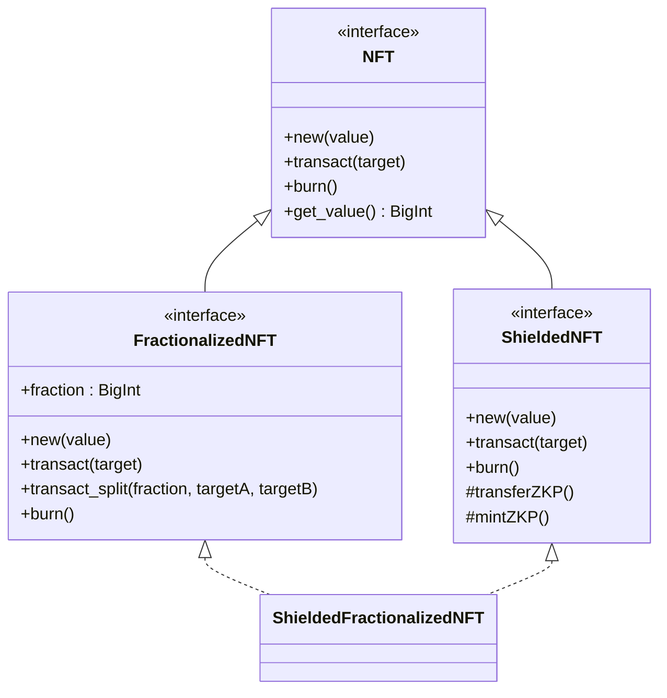

# Overview of architecture

## Packages

## The NFT package

```mermaid
classDiagram
    NFT <|-- FractionalizedNFT
    NFT <|-- ShieldedNFT
    FractionalizedNFT <|.. ShieldedFractionalizedNFT
    ShieldedNFT <|.. ShieldedFractionalizedNFT
    class NFT {
        <<interface>>
        +new(value)
        +transact(target)
        +burn()
        +get_value() BigInt
    }
    class FractionalizedNFT {
        <<interface>>
        +fraction : BigInt
        +new(value)
        +transact(target)
        +transact_split(fraction, targetA, targetB)
        +burn()
    }
    class ShieldedNFT {
        <<interface>>
        +new(value)
        +transact(target)
        +burn()
        #transferZKP()
        #mintZKP()
    }
    class ShieldedFractionalizedNFT
    
```
